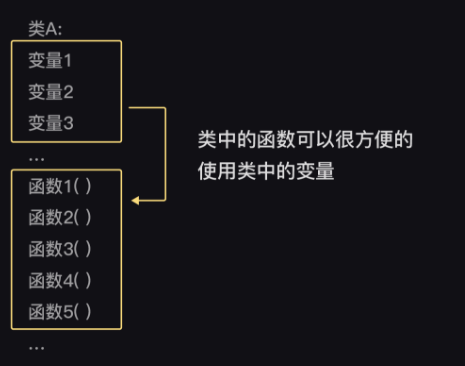

# 类

## **类的理解**： **【类】是一个函数包。**

**类中可以放置函数和变量，然后类中的函数可以很方便的使用类中的变量。**



### **类中可以放置函数和变量**

#### 用class语句来自定义一个类

```python
# 语法：创建一个名为“ClassName”的类，类名一般首字母要大写，(): 不能丢   

class ClassName(): # 如定义一个名为'狗'的类，可以写成class Dog():
# 规范：class语句后续的代码块要缩进  
    def function1(): # 定义类中的函数1
        执行语句1
    def function2(): # 定义类中的函数2
        执行语句2
    def function3(): # 定义类中的函数3
        执行语句3
```


#### 我们使用**类名.函数名\(\)**的格式，就可以让类的方法运行起来。

在类中被定义的函数被称为类的**【方法】**，描述的是这个类能做什么。  
调用格式：**类名.函数名\(\)**

```python
class 类A():
    def 函数1():
        print('报道！我是类A的第一个方法！')
# 为了让代码更直观，一般会把类中的函数和函数之间换行隔开        
    def 函数2():
        print('报道！我是类A的第二个方法！')
        
    def 函数3():
        print('报道！我是类A的第三个方法！')
# 以上为类的【方法】        

类A.函数1()
类A.函数2()
类A.函数3()
# 》》
报道！我是类A的第一个方法！
报道！我是类A的第二个方法！
报道！我是类A的第三个方法！

```

在类中被定义的变量被称为类的**【属性】**。  
调用格式：**类名.变量**

```python
class 类A():
# 类中的变量
    变量1 = 100
    变量2 = -5.83
    变量3 = 'abc'
# 以上为类【属性】
        
# 可以在类的外面，增加或修改类的属性
类A.变量1 = 99
类A.变量4 = '新增一个变量'

print(类A.变量1)
# 》》99
print(类A.变量4)
# 》》新增一个变量
```

### **类方法和类属性可以组合**

为了把类中的变量传递给类中的函数，我们需要用到3个特定格式：


① 第一个格式**@classmethod**的中文意思就是“类方法”，@classmethod声明了函数1是类方法，这样才能允许函数1使用类属性中的数据。  
  
**②** 第二个格式**cls**的意思是class的缩写。如果类方法函数1想使用类属性（也就是类中的变量），就要写上cls为函数1的第一个参数，也就是把这个类作为参数传给自己，这样就能被允许使用类中的数据。  
③  第三个格式是 **cls.变量**。类方法想使用类属性的时候，需要在这些变量名称前加上cls.。

**注**：当类中的函数【不需要】用到类中的变量时，就不要用@classmethod、cls、cls.三处格式，否则终端也会给你报错。  
但若是在类方法里设变量并引用，则无需这样做

## 给类方法传参

### 类方法仅使用外部参数

```python
saying=['fortune','favors','the','blod'] #外部参数

class dictum():
    def dic_funct(param): #只使用了外部的参数，没有使用类属性，所以格式上不需要@classmethod和cls
        for i in param: # param:参数
            print(i)
dictum.dic_funct(saying)
# 》》
fortune
favors
the
blod            
```

### 类方法仅使用内部参数

```python
class dictum():
    saying=['fortune','favors','the','blod'] #内部参数
    
    @clssmethod
    def dic_funct(cls): 
        for i in cls.saying: 
            print(i)
dictum.dic_funct()
# 》》
fortune
favors
the
blod         
```

### 类方法同时使用内部参数和外部参数

```python
class dictum():
    saying=['fortune','favors','the','blod'] #内部参数
    
    @clssmethod
    def dic_funct(cls,param_1,param_2): #可使用多个外部参数
        print('author:'+param_1+','+param_2)
        for i in cls.saying: 
            print(i)
dictum.dic_funct('a','b') #'a'和‘b’为外部参数。也可先给这两参数赋值给变量，再引用变量
# 》》
author:a,b
fortune
favors
the
blod         
```

#### 

#### 拓展：类方法不但能调用类属性，还能直接调用其他类方法。

```python
class 成绩单():
    @classmethod
    def 录入成绩单(cls):
        cls.学生姓名 = input('请输入学生姓名：')
        cls.成绩 = int(input('请输入考试成绩：'))

    @classmethod
    def 计算是否及格(cls):
        if cls.成绩 >= 60:
            return '及格'
        else:
            return '不及格'
# 调用了类方法
#方法1：
    @classmethod
    def 考试结果(cls):
        if cls.计算是否及格() == '及格': 
            print(cls.学生姓名 + '同学考试通过啦！')
        else:
            print(cls.学生姓名 + '同学需要补考！')
        
        #方法2：
        '''
        result=cls.计算是否及格()
        if result=='及格':
            print(cls.学生姓名+'考试通过了！')
        elif result=='不及格':
            print(cls.学生姓名+'需要补考')    
         '''   

成绩单.录入成绩单()
成绩单.考试结果()
#》》
请输入学生姓名：王明明
请输入考试成绩：59
王明明同学需要补考！
```

## 增加/修改类属性


### 方法1：从外部，用【类.变量 = xx】直接增加/修改类属性

```python
变量1 = 15
#这是类外部的变量1
变量2 = 'abc'

class 类A():
    变量1 = 100
    #这是类属性变量1

变量1 = 类A.变量1
类A.变量2 = 变量2

print(类A.变量1)
# 》》100
print(类A.变量2)
#》》abc
```

### 方法2：从内部，用【类方法】去增加/修改类属性

```python
class 类():
    @classmethod
    def 增加类属性(cls): 
        cls.变量 = input('请随意输入字符串：')

类.增加类属性()

print('打印新增的类属性：')
print(类.变量)

# 输入abc
#》》
打印新增的类属性：
abc
```


